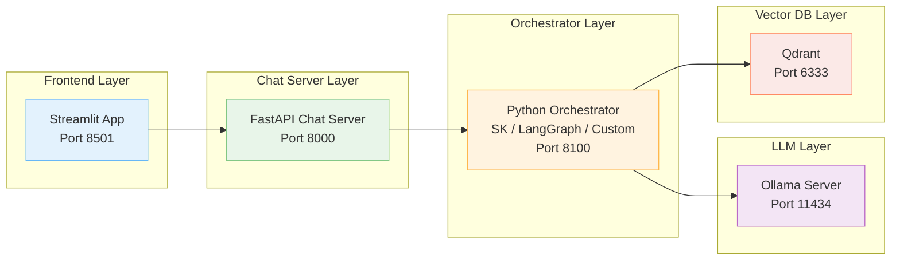

# Agentic AI Playground

A modular, container-based environment for experimenting with multi-agent orchestration, A2A communication, MCP, and local LLMs.

This repository provides a fully containerized playground for building and testing AI agent orchestration architectures, including:
	•	Front-end UI (Streamlit)
	•	Chat server (FastAPI)
	•	Orchestrator layer (Semantic Kernel, LangGraph, custom loops)
	•	Local LLM (Ollama)
	•	Vector database (Qdrant)

The goal is to explore agent routing, memory, function-calling, A2A, MCP, and multi-layer orchestration in a reproducible local environment.


## Architecture Overview




## Getting Started
### 1. Clone the repo
```
git clone https://github.com/<your-username>/agenticai-playground.git
cd agenticai-playground
```

### 2. Build containers
```
docker compose build
```

### 3. Start services
```
docker compose up -d
```

### 4. Install an LLM model via Ollama
```
docker exec -it ai_ollama bash
ollama pull llama3.1
exit
```

### 5. Access the playground
•	Streamlit app:
    http://localhost:8501
•	Chat server health:
    http://localhost:8000/health
•	Orchestrator health:
    http://localhost:8100/health